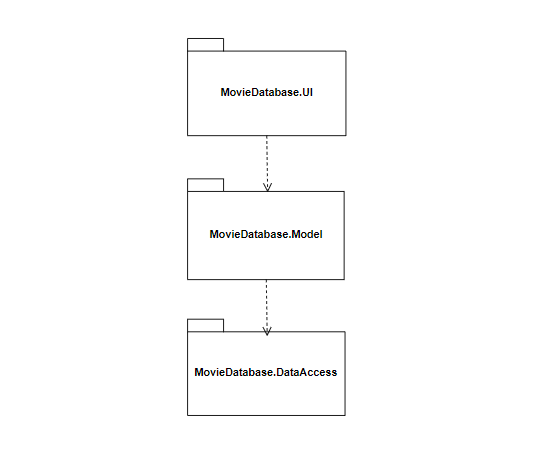
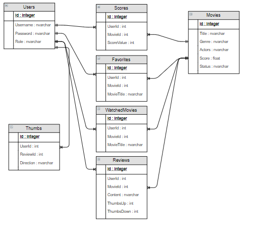

# Project Analysis And Design

# Movie Database Specification
Design and implement a desktop application for a Movie Database. The application should have two types of users (a regular user and an administrator user) which have to provide a username and a password in order to use the application.The regular user can perform the following operations: search movies by genre, title, actors and rate the movies. The administrator can perform the following operations: CRUD on movies, CRUD on regular users' information and generate report files.

# Elaboration – Iteration 1.1

## Domain Model

## Conceptual Diagram

## Architectural Design

### Conceptual Architecture
#### MVVM
ViewModel does not need a reference to a view. The view binds to properties on a ViewModel, which, in turn, exposes data contained in model objects and other state specific to the view. The bindings between view and ViewModel are simple to construct because a ViewModel object is set as the DataContext of a view. If property values in the ViewModel change, those new values automatically propagate to the view via data binding. When the user clicks a button in the View, a command on the ViewModel executes to perform the requested action. The ViewModel, never the View, performs all modifications made to the model data.

The view classes have no idea that the model classes exist, while the ViewModel and model are unaware of the view. In fact, the model is completely oblivious to the fact that the ViewModel and view exist. This is a very loosely coupled design.

### Package Design

### Component and Deployment Diagrams

# Elaboration – Iteration 1.2

## Design Model

### Dynamic Behavior
Login sequence diagram

Communication diagram

### Class Design
Factory method is a creational design pattern. In Factory pattern, we create object without exposing the creation logic to client and the client use the same common interface to create new type of object. A factory pattern is one of the core design principles to create an object, allowing clients to create objects in a way such that it doesn’t have tight coupling.

### Data Model

### Unit Testing
In the project I used the framework Moq for .NET to create units tests. Moq provides a library that makes it simple to set up, test, and verify mocks. Mock objects allow you to mimic the behavior of classes and interfaces, letting the code in the test interact with them as if they were real. This isolates the code you’re testing, ensuring that it works on its own and that no other code will make the tests fail.

# Elaboration – Iteration 2

## Architectural Design Refinement
### Conceptual Diagram

### Package Design

### Component and Deployment Diagram
     
  
The changes I made are based on the client-server architecture that is a structure that partitions tasks between the providers of a service (server) and service requester (client).

## Design Model Refinement
Factory method is a creational design pattern. In Factory pattern, we create object without exposing the creation logic to client and the client use the same common interface to create new type of object. A factory pattern is one of the core design principles to create an object, allowing clients to create objects in a way such that it doesn’t have tight coupling.

# Construction and Transition

## System Testing
In the project I used the framework Moq for .NET to create units tests. Moq provides a library that makes it simple to set up, test, and verify mocks. Mock objects allow you to mimic the behavior of classes and interfaces, letting the code in the test interact with them as if they were real. This isolates the code you’re testing, ensuring that it works on its own and that no other code will make the tests fail.

## Future improvements
The application can be improved by adding functionalities like a list of theaters where a movie can be watched, a Blu-ray release date, a movie poster, or trailer.

# Bibliography
- [MVVM](https://msdn.microsoft.com/en-us/magazine/dd419663.aspx)
- [Architectural Styles](https://docs.microsoft.com/en-us/azure/architecture/guide/architecture-styles/)
- [Architectural Patterns and Styles](https://msdn.microsoft.com/en-us/library/ee658117.aspx)
- [Yet another online diagram drawing software](https://www.draw.io)
- [Mocking with Moq](https://spin.atomicobject.com/)
- [Factory](https://www.geeksforgeeks.org)

