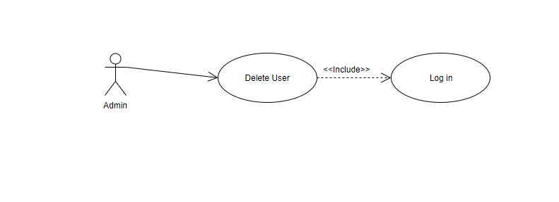

# Movie Database Use Case Model

# Use-Cases Identification

## Use case 1
* **Use case**: user logs into the application
* **Level**: sub-function
* **Primary actor**: user
* **Main success scenario**: user enters username and password into the login form, clicks login and logs into the app with success
* **Extensions**: user enters wrong username or password and gets a warning that a wrong username or password was entered

## Use case 2
* **Use case**: user searches a movie and selects the movie
* **Level**: user-goal level
* **Primary actor**: user
* **Main success scenario**: searches for a movie, selects a movie and the movie details are displayed  

## Use case 3
* **Use case**: admin adds a movie into the application
* **Level**: sub-function
* **Primary actor**: administarator
* **Main success scenario**: an admin user adds a movie into the application by completing all required fields
* **Extensions**: an admin user tries to add a movie without completing all the required fields. In this case warning messages will pop-up and the user will not be able to add the movie into the application.

## Use case 4
* **Use case**: admin deletes an application user
* **Level**: sub-function
* **Primary actor**: administrator
* **Main success scenario**: an admin user selects a user and deletes the user

# UML Use-Case Diagrams

## Diagram 1

## Diagram 2

## Diagram 3

## Diagram 4

## Full Diagram

# Bibliography

* [Online diagram drawing software](https://yuml.me/) ([Samples](https://yuml.me/diagram/nofunky/usecase/samples))
* [Yet another online diagram drawing software](https://www.draw.io)
